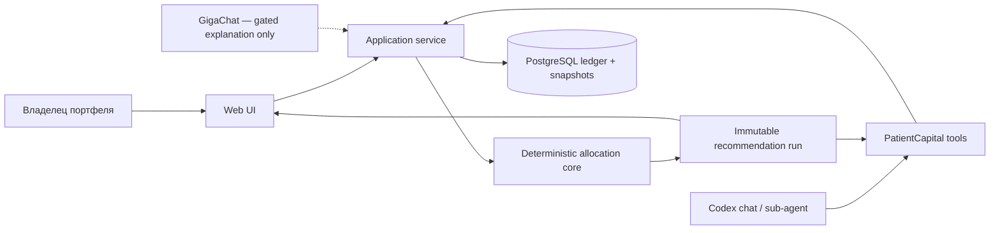
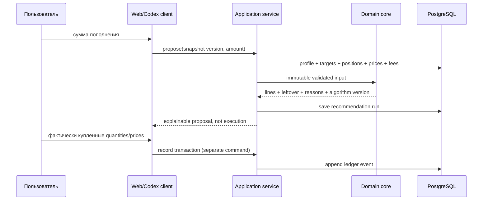

# Архитектура

## Контекст

PatientCapital — локальное приложение с web-клиентом, Python API, PostgreSQL и общим чистым domain
core. Пользователь вручную вводит факты, которые система не может надёжно получить: цели, операции,
цены/дату цены, лоты и комиссионную схему. Domain core рассчитывает snapshot, drift и предложение
покупок. API сохраняет входы и доказательства calculation run; web UI и agent tools являются
равноправными клиентами одного application service.

Codex работает с приложением через ограниченные tools и может объяснять результат в чате.
GigaChat — внешний экспериментальный provider, который после отдельного gate сможет преобразовать
естественный язык в строгий intent или объяснить уже готовый план. Ни один LLM не владеет данными,
математикой и исполнением.

## Инварианты

- Денежные значения используют `Decimal` и явную валюту; binary float запрещён в domain/DB/API.
- План не расходует больше доступного взноса с учётом всех комиссий и cash buffer.
- Количество покупаемого актива кратно lot size; цена, lot и fee обязаны иметь источник/версию.
- Target weights должны быть неотрицательны и составлять ровно 100% в пределах заданного допуска.
- Отсутствующая/просроченная цена, неизвестная валюта, неполная fee policy или неоднозначная цель
  блокирует затронутый расчёт видимой ошибкой; система не подставляет удобный default.
- Один calculation run является immutable snapshot: входы, версия алгоритма, результат, причины
  пропуска и время сохраняются вместе.
- LLM не может создать новый asset, изменить числовой результат core или пометить план исполненным.
- `proposed` не равно `executed`: позиция меняется только после отдельной ручной записи операции.
- MVP не вызывает broker order API и не обещает доходность.
- Секреты не хранятся в БД, не возвращаются API и не попадают в logs/commits.

## Компоненты и границы

| Компонент | Единственная ответственность | Поведение при отказе |
| --- | --- | --- |
| `domain` | Money, targets, positions, fees, drift, discrete allocation, reasons | typed validation/domain error; частичный правдоподобный план запрещён |
| `application` | use cases и транзакционные границы | rollback и явный failure result |
| `api` | versioned HTTP contracts и input validation | 4xx для входа, 409 для version conflict, 503 для dependency |
| `persistence` | PostgreSQL repositories и migrations | health degraded; запись не подтверждается |
| `web` | четыре пользовательских поверхности и explanation UX | сохраняет ввод или показывает точную ошибку API |
| `agent tools` | узкие get/propose/record операции | те же схемы/permissions, что application service |
| `GigaChat adapter` | intent/explanation после quality gate | timeout/schema/grounding failure возвращает deterministic result без model prose |

## Первичный аудит решений

### Что может работать

- Долгосрочное пополнение хорошо раскладывается на детерминированную задачу сведения target drift с
  дискретными лотами и комиссиями; результат можно проверить независимо.
- Ручной журнал операций и price snapshot позволяет начать без хрупкой брокерской/market-data
  интеграции и сохраняет provenance.
- GigaChat технически поддерживает JSON Schema и пользовательские functions, поэтому может быть
  внешним natural-language adapter, если пройдёт фактический eval.

### Что нельзя обещать

- Текстовая LLM не является источником котировок, не доказывает пригодность инструмента и может
  выдавать искажённые сведения; официальная документация GigaChat прямо требует проверять ответы.
- Простое предупреждение «не инвестиционная рекомендация» не устраняет возможный регулируемый
  характер персонального buy-list. До legal review продукт остаётся личным локальным прототипом.
- «Оптимальная» покупка не определена без target policy, горизонта, риска, ликвидности, налогов и
  допустимого universe. MVP оптимизирует только отклонение от введённых пользователем target
  weights в известных ограничениях и честно называет это rebalancing contribution plan.

### Stack decision

- **Python 3.12+, FastAPI, Pydantic, SQLAlchemy, Alembic, pytest, Hypothesis, Ruff, mypy**: Python
  делает денежный domain и property tests компактными; явные модели и миграции сохраняют authority.
- **PostgreSQL**: транзакции, numeric types и JSON evidence позволяют хранить ledger и immutable
  runs в одной модели восстановления.
- **TypeScript web client**: typed contracts и зрелые chart/form primitives; frontend не повторяет
  формулы core.
- **Docker Compose**: одинаковый API/web/DB runtime для разработки и передачи.
- Тяжёлый optimizer не добавляется до eval-доказательства, что deterministic greedy baseline не
  проходит продуктовые критерии; meta-механизмом является corpus/property gate, а не библиотека.

## Основной flow

## Flow нового пополнения

## Значимые решения

- Принята дорогая межкомпонентная граница: deterministic core — единственный владелец финансовой
  арифметики; LLM — недоверенный adapter. До стабилизации интерфейсов rationale хранится здесь;
  при принятии конкретного provider/tool protocol будет создан ADR.
- Market prices являются versioned input, а не неявным network call внутри расчёта.
- Portfolio — производная ledger + price snapshot; recommendation никогда не мутирует ledger.
