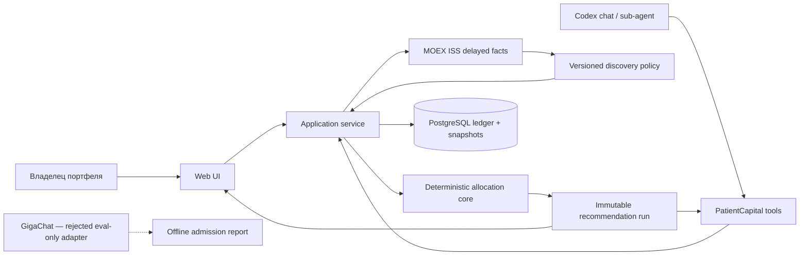
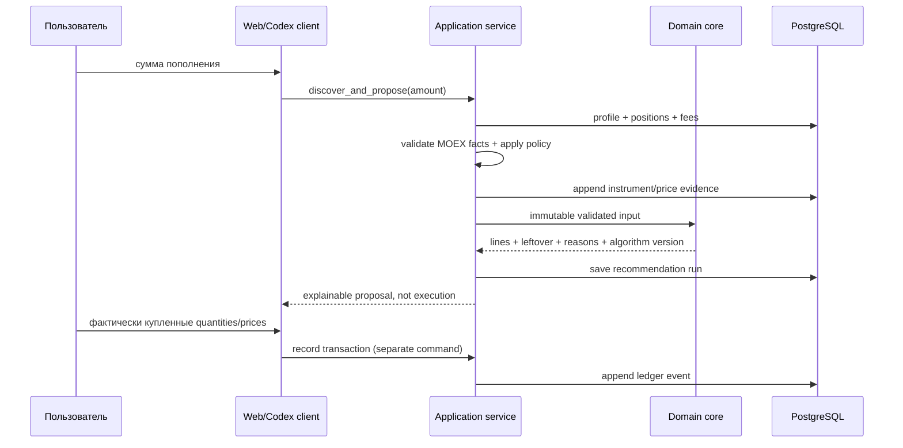

# Архитектура

## Контекст

PatientCapital — локальное приложение с web-клиентом, Python API, PostgreSQL, MOEX ISS adapter и
общим чистым domain core. В основном потоке пользователь вводит сумму, а система сама получает
source-backed security/price/lot facts и применяет версионированную пятилетнюю policy. Пользователь
по-прежнему владеет broker fees, risk profile и фактическими BUY/SELL. Domain core рассчитывает
snapshot, drift и предложение покупок. API сохраняет входы и доказательства calculation run; web UI
и agent tools являются равноправными клиентами одного application service.

Codex работает с приложением через ограниченные tools и может объяснять результат в чате или
sub-agent flow. Это выбранная реализация допускавшегося objective agent mode; web UI не запускает
Codex и не зависит от доступности агента. Оба канала вызывают один application service независимо.
GigaChat был проверен как внешний экспериментальный provider для strict intent/explanation, но не
прошёл live quality gate и не входит в runtime. Ни один LLM не владеет данными, математикой и
исполнением.

## Инварианты

- Денежные значения используют `Decimal` и явную валюту; binary float запрещён в domain/DB/API.
- План не расходует больше доступного взноса с учётом всех комиссий и cash buffer.
- Количество покупаемого актива кратно lot size; цена, lot и fee обязаны иметь источник/версию.
- Automatic discovery принимает market facts только от allowlisted MOEX HTTPS adapter; LLM output
  не может стать security master или price snapshot.
- Target weights должны быть неотрицательны и составлять ровно 100% в пределах заданного допуска.
- Отсутствующая/просроченная цена, неизвестная валюта, неполная fee policy или неоднозначная цель
  блокирует затронутый расчёт видимой ошибкой; система не подставляет удобный default.
- Один calculation run является immutable snapshot: входы, версия алгоритма, результат, причины
  пропуска и время сохраняются вместе.
- LLM не может создать/подменить asset, изменить policy/числовой результат core или пометить план
  исполненным. Материализация валидированного MOEX instrument выполняется только application service.
- `proposed` не равно `executed`: позиция меняется только после отдельной ручной записи операции.
- Облигационная BUY хранит clean unit price, общий НКД и fee раздельно; cost-basis projection
  складывает их детерминированно и не подменяет clean price синтетической dirty unit price.
- MVP не вызывает broker order API и не обещает доходность.
- Секреты не хранятся в БД, не возвращаются API и не попадают в logs/commits.

## Компоненты и границы

| Компонент | Единственная ответственность | Поведение при отказе |
| --- | --- | --- |
| `domain` | Money, targets, positions, fees, drift, discrete allocation, reasons | typed validation/domain error; частичный правдоподобный план запрещён |
| `application` | use cases и транзакционные границы | rollback и явный failure result |
| `api` | versioned HTTP contracts и input validation | 4xx для входа, 409 для version conflict, 503 для dependency |
| `persistence` | PostgreSQL repositories и migrations | health degraded; запись не подтверждается |
| `marketdata` | allowlisted MOEX ISS transport и strict mapping в immutable candidate facts | timeout/schema/stale/unknown блокирует automatic run typed-ошибкой |
| `selection policy` | versioned eligibility, maturity/liquidity ranking и class targets | пустой eligible set блокирует proposal; LLM fallback запрещён |
| `web` | четыре пользовательских поверхности и explanation UX | сохраняет ввод или показывает точную ошибку API |
| `agent tools` | узкие get/propose/record операции для Codex chat/sub-agent | те же схемы/permissions, что application service |
| `GigaChat eval adapter` | offline admission нового provider/model | любой провал оставляет runtime выключенным; deterministic result не зависит от model prose |

## HTTP API v1

| Метод | Путь | Authority / эффект |
| --- | --- | --- |
| `GET/PUT` | `/v1/profile` | latest/next immutable profile version; optimistic concurrency |
| `GET/PUT` | `/v1/assets[/{id}]` | latest/next asset/target version |
| `POST` | `/v1/assets/{id}/prices` | append-only manual price snapshot |
| `POST` | `/v1/transactions` | idempotent append-only BUY/SELL с отдельным total НКД |
| `GET` | `/v1/portfolio` | derived quantities, cost basis, value, P&L, allocation/drift |
| `POST/GET` | `/v1/recommendations[/{id}]` | calculate/store or retrieve immutable domain run |
| `POST` | `/v1/discovery/recommendations` | fetch/validate MOEX candidates, apply policy and persist deterministic proposal |
| `GET` | `/health/live`, `/health/ready` | process health отдельно от PostgreSQL readiness |

Все денежные JSON-поля сериализуются decimal-строками. Ошибка имеет один envelope
`{"error":{"code","message"}}`; transport не превращает domain unknown в HTTP 200.

## Первичный аудит решений

### Что может работать

- Долгосрочное пополнение хорошо раскладывается на детерминированную задачу сведения target drift с
  дискретными лотами и комиссиями; результат можно проверить независимо.
- Delayed MOEX ISS позволяет убрать обязательный ручной ticker/price/lot input и сохранить
  provenance без broker credentials; availability/licensing остаются отдельными ограничениями.
- GigaChat технически поддерживает JSON Schema, но live eval показал, что schema compliance не
  гарантирует grounded intent/explanation. Текущая версия отклонена как runtime adapter.

### Что нельзя обещать

- Текстовая LLM не является источником котировок, не доказывает пригодность инструмента и может
  выдавать искажённые сведения; официальная документация GigaChat прямо требует проверять ответы.
- Простое предупреждение «не инвестиционная рекомендация» не устраняет возможный регулируемый
  характер персонального buy-list. До legal review продукт остаётся личным локальным прототипом.
- «Оптимальная» покупка не определена без target policy, горизонта, риска, ликвидности, налогов и
  допустимого universe. MVP оптимизирует только отклонение от введённых пользователем target
  weights в известных ограничениях и честно называет это rebalancing contribution plan.

### Stack decision

- **Python 3.12+, FastAPI, Pydantic, SQLAlchemy, Alembic, pytest, Hypothesis, Ruff, mypy**: Python
  делает денежный domain и property tests компактными; явные модели и миграции сохраняют authority.
- **PostgreSQL**: транзакции, numeric types и JSON evidence позволяют хранить ledger и immutable
  runs в одной модели восстановления.
- **TypeScript web client**: typed contracts и зрелые chart/form primitives; frontend не повторяет
  формулы core.
- **Docker Compose**: одинаковый API/web/DB runtime для разработки и передачи.
- Тяжёлый optimizer не добавляется до eval-доказательства, что deterministic greedy baseline не
  проходит продуктовые критерии; meta-механизмом является corpus/property gate, а не библиотека.

## Основной flow

Agent path заканчивается на MCP boundary: зарегистрированный Codex STDIO client запускает
`patientcapital-mcp`, а adapter обращается к тому же HTTP/application contract, что web. UI не
встраивает Codex app-server и не имеет скрытой кнопки, которая может инициировать сделку.

## Flow нового пополнения

## Значимые решения

- Принята дорогая межкомпонентная граница: deterministic core — единственный владелец финансовой
  арифметики; LLM — недоверенный adapter. До стабилизации интерфейсов rationale хранится здесь;
  при принятии конкретного provider/tool protocol будет создан ADR.
- Market lookup происходит до domain calculation; валидированный ответ материализуется как
  versioned input snapshot, а network call никогда не скрыт внутри чистого allocator.
- Portfolio — производная ledger + price snapshot; recommendation никогда не мутирует ledger.

<!-- immune-project-engineering:architecture:start -->
## Технологический выбор

Stack rationale принадлежит разделу `Stack decision` выше, а alternatives — `docs/AUDIT.md`.
Ключевой trade-off: Python/Decimal/Pydantic/PostgreSQL дают компактную проверяемую financial/data
boundary, но требуют отдельного TypeScript build и не доказывают performance без benchmark. Новая
runtime technology не добавляется без требования, owner boundary и independent evidence.

## Docker-контур

| Service | Build/runtime | Dependency/health | State и exposure |
| --- | --- | --- | --- |
| `db` | pinned `postgres:17-alpine` | `pg_isready` | named volume; loopback port 55432 |
| `api` | pinned Python 3.13 slim, core deps only, non-root/read-only | healthy DB → Alembic head → DB readiness query | stateless; loopback port 8000; `/tmp` tmpfs |
| `web` | pinned Node 22 multi-stage Vinext build, non-root/read-only | healthy API → HTTP root health | generated bundle; loopback port 3000; `/tmp` tmpfs |

Compose передаёт API application/DB/CORS и allowlisted MOEX timeout/base URL config, а также
`GIGACHAT_ENABLED=false`; model keys не входят в images/environment. Browser-visible API URL
bake-time и указывает на host loopback.
`scripts/docker-smoke.sh` создаёт изолированный project/volume и доказывает full HTTP flow. Logs,
startup/shutdown, backup, destructive restore caveats, upgrade/rollback и непроверенные limits
принадлежат `docs/OPERATIONS.md`. Public rollout, SLO/alerts, HA и automatic recovery отсутствуют.
<!-- immune-project-engineering:architecture:end -->
