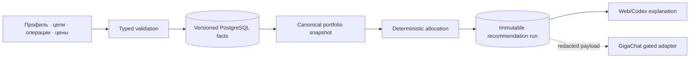

# Данные

## Сущности и владельцы

| Сущность | Назначение | Владелец | Идентификатор |
| --- | --- | --- | --- |
| `InvestorProfile` | горизонт, risk label, base currency, cash buffer | profile service | UUID, version |
| `BrokerAccount` | брокер, счёт и fee policy reference | profile service | UUID |
| `FeePolicy` | commission rules/minimums/effective interval | fee domain | UUID, version |
| `Asset` | инструмент, currency, lot size, enabled state | asset catalog | UUID; ticker не является ключом |
| `TargetAllocation` | желаемая доля актива и effective interval | policy domain | UUID, version |
| `PriceSnapshot` | цена, as-of, source и freshness status | market-data boundary | UUID |
| `Transaction` | append-only факт buy/sell/deposit/fee | ledger | UUID, idempotency key |
| `PositionSnapshot` | производный quantity/cost/value/P&L | analytics projection | run UUID |
| `RecommendationRun` | immutable inputs, algorithm version, lines/reasons | allocation service | UUID |
| `ModelEvaluation` | provider/model/prompt/corpus и измеренные outcomes | quality subsystem | UUID |

## Lifecycle и версии

Профиль, fee policy, target allocation, asset parameters и price snapshot версионируются. Изменение
не переписывает старый `RecommendationRun`: run ссылается на версии входов или содержит их
канонический snapshot/hash. Transaction append-only; исправление создаётся compensating event с
ссылкой на исходное событие. Position/analytics являются projection ledger на заданное время и
набор цен, поэтому могут быть перестроены.

В MVP удаление пользователя отсутствует из-за single-user режима. Для будущего публичного режима
retention и право на удаление являются отдельным requirement, а не silent cascade. Backup должен
включать PostgreSQL; `.env` и model credentials восстанавливаются из отдельного secret store.

Фактическая schema реализует `profile_versions` и `asset_versions` как append-only ряды,
`price_snapshots`, `transactions` и `recommendation_runs` как append-only evidence. PostgreSQL
triggers запрещают `UPDATE/DELETE`; исправление производится новой version/event. Стабильный
`assets.id` является identity, ticker не переиспользуется как изменяемое имя.

## Provenance и чувствительность

Профиль, цели, брокер, комиссии и ledger считаются конфиденциальными финансовыми данными. Они не
передаются GigaChat целиком: после допуска внешний provider получает минимальный redacted
explanation payload без broker account identifiers. Каждый price хранит source, `as_of` и дату
получения; ручной источник помечается `manual`, а не маскируется под market feed.

Каждый run сохраняет canonical input hash, algorithm version, requested amount, selected prices,
fee policy, output и reason codes. Model explanation дополнительно хранит provider/model version,
prompt version, latency, usage и response hash, но никогда не становится источником чисел.

## Data flow

## Валюты и время

Начальный MVP запрещает cross-currency allocation: профиль, цена и актив должны быть в base
currency. Расширение требует versioned FX snapshot и отдельного eval. Все timestamps хранятся в UTC,
UI отображает timezone пользователя; `date` без timezone не используется для freshness.

## Восстановление

Ledger, versioned policies и price snapshots — первичные факты. Positions, analytics и предложения
перестраиваются из них указанной версией алгоритма. Если старая версия кода недоступна,
сохранённый immutable run остаётся свидетельством, но не переисполняется молча новой версией.
