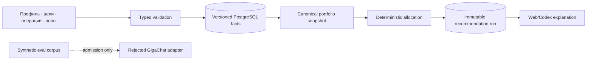

# Данные

## Сущности и владельцы

| Фактическая таблица/проекция | Назначение | Authority | Идентификатор |
| --- | --- | --- | --- |
| `profile_versions` | currency, horizon, risk label, cash buffer, broker name и fee fields | profile application service | integer `version` |
| `assets` | стабильная identity инструмента | asset application service | user-supplied string `id` |
| `asset_versions` | name, currency, lot, target weight, active state | asset application service | (`asset_id`, integer `version`) |
| `price_snapshots` | manual price, currency, as-of, max age и source | price boundary | UUID |
| `transactions` | append-only фактический `BUY`/`SELL` с fee | ledger service | UUID + unique idempotency key |
| `recommendation_runs` | immutable input/output snapshots, amount, totals, reason и algorithm evidence | recommendation service | UUID |
| portfolio response | quantity, cost/value/P&L, allocation и drift | derived application query | не хранится отдельной таблицей |
| GigaChat admission report | model/prompt/corpus hashes, metrics, latency/usage и case evidence | file `reports/gigachat-admission-v1.json` | report/corpus version; не DB entity |

## Lifecycle и версии

Профиль создаёт следующую integer version; broker/fee fields являются частью той же profile version,
а не отдельными таблицами. Asset identity стабильна, а параметры/target создают следующую
`asset_versions` row. Price, transaction и recommendation rows append-only. PostgreSQL triggers
отклоняют `UPDATE/DELETE` для `profile_versions`, `asset_versions`, `price_snapshots`, `transactions`
и `recommendation_runs`.

API поддерживает только `BUY` и `SELL`. Formal compensating-event link в schema отсутствует;
исправление вводится новой фактической операцией с новым idempotency key и поясняющей `note`, если
position invariant это допускает. Добавлять `DEPOSIT`, `FEE` или correction reference без новой
migration/API decision нельзя.

В MVP delete API отсутствует. Для будущего публичного режима retention и право на удаление являются
отдельным requirement, а не silent cascade. Backup включает named PostgreSQL volume через logical
dump; `.env` и model credentials никогда не входят в DB backup и восстанавливаются отдельно.

`RecommendationRun.input_snapshot` фиксирует использованные profile/asset/price/position facts;
`output_snapshot` фиксирует lines и domain totals. Старый run не пересчитывается новой algorithm
version. `assets.id` является business identity; отдельного broker security master/ticker resolver
в MVP нет.

## Provenance и чувствительность

Профиль, цели, брокер, комиссии и ledger считаются конфиденциальными финансовыми данными. Текущий
runtime не вызывает GigaChat и ничего ему не передаёт; live admission использовал только synthetic
versioned corpus. Любая будущая model integration потребует нового approved minimal-payload
contract. Каждый price хранит source, `as_of`, `max_age_seconds` и `created_at`; manual source не
маскируется под market feed.

Каждый run сохраняет canonical input hash, algorithm version, requested amount, selected facts,
output и reason. GigaChat report хранит provider/model, prompt/corpus hashes, latency, usage и raw
response hash, но не raw prompt/output и никогда не становится источником portfolio facts.

## Data flow

## Валюты и время

Начальный MVP запрещает cross-currency allocation: профиль, цена и актив должны быть в base
currency. Расширение требует versioned FX snapshot и отдельного eval. Все timestamps хранятся в UTC,
UI отображает timezone пользователя; `date` без timezone не используется для freshness.

## Восстановление

Profile/asset versions, prices и ledger — первичные DB facts. Portfolio analytics перестраиваются из
них; recommendation run остаётся immutable evidence и не переисполняется молча новой algorithm
version. Проверенные startup/shutdown/backup команды и честный статус restore rehearsal находятся в
`docs/OPERATIONS.md`. Удаление named volume без backup необратимо для product data.
