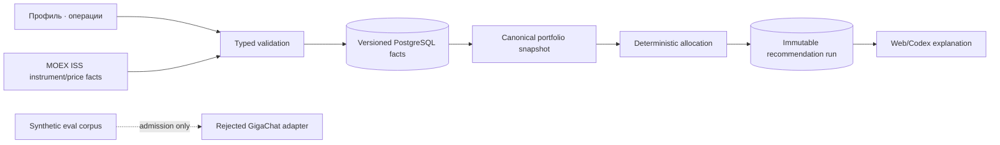

# Данные

## Сущности и владельцы

| Фактическая таблица/проекция | Назначение | Authority | Идентификатор |
| --- | --- | --- | --- |
| `profile_versions` | currency, horizon, risk label, cash buffer, broker name и fee fields | profile application service | integer `version` |
| `assets` | стабильная identity инструмента | asset application service | user-supplied legacy id или validated MOEX `SECID` |
| `asset_versions` | name, currency, lot, target weight, active state | manual legacy или automatic selection service | (`asset_id`, integer `version`) |
| `price_snapshots` | manual legacy или MOEX-derived price, currency, as-of, max age и source | price/marketdata boundary | UUID |
| `transactions` | append-only `BUY`/`SELL`: clean unit price, total НКД и fee | ledger service | UUID + unique idempotency key |
| `transaction_drafts` | immutable extracted fields, source hash/metadata, unknowns/conflicts/confidence | transaction-intake service | UUID + version `1` |
| `transaction_draft_decisions` | immutable explicit confirm/reject; optional exact transaction link | draft-decision service | UUID + unique draft id |
| `recommendation_runs` | immutable input/output snapshots, amount, totals, reason и algorithm evidence | recommendation service | UUID |
| `proposal_sets` | amount/profile version, ordered strategy metadata и refs на `1..3` runs | proposal application service | UUID |
| `market_research_snapshots` | immutable scan: provider/policy/status, coverage и typed public candidate JSON | market-intelligence service | UUID + unique idempotency key |
| `asset_admission_runs` | immutable composition batch для market snapshot: policy/scope/status/counts/expiry | asset-admission service | UUID + unique snapshot/policy |
| `asset_admission_assessments` | immutable профиль актива: liquidity/investment gates, verdict, reasons, sources и fact times | deterministic asset-admission policy | UUID + unique run/asset/policy |
| portfolio / analytics response | quantity, cost/value, realized/unrealized result, allocation/drift, freshness/activity и metric status | derived application query `analytics-ledger-v1` | не хранится отдельной таблицей |
| GigaChat admission report | model/prompt/corpus hashes, metrics, latency/usage и case evidence | file `reports/gigachat-admission-v1.json` | report/corpus version; не DB entity |

### PC2 authorities

| Сущность | Назначение | Authority / invariant |
| --- | --- | --- |
| research evidence *(implemented in run snapshot)* | normalized issuer/market/corporate-action/dividend facts и provenance | typed source adapter; source/observed/freshness/schema/policy обязательны |
| transaction draft *(implemented)* | исходный text/image hash, extraction, resolved instrument, confidence и unknowns | transaction-intake service; immutable и unconfirmed |
| draft decision *(implemented)* | explicit confirm/reject и exact confirmed payload/version | append-only; только confirm может вызвать существующий transaction command |
| monitor run / alert / acknowledgement *(implemented)* | schedule/policy/input/result, trigger/no-op/error evidence и user acknowledgement | monitor service; immutable, без transaction/order side effect |
| `issuer_evidence_snapshots` *(implemented)* | exact security/ISIN, provider status, immutable reviewed packet/source hashes либо typed failure | issuer-evidence provider; один content-addressed result на identity + observation |
| `asset_admission_runs` / `asset_admission_assessments` *(implemented)* | versioned liquidity + investment verdicts и exact issuer-evidence reference | admission service; run identity включает market snapshot, policy и evidence-set hash |

## Lifecycle и версии

Профиль создаёт следующую integer version; broker/fee fields являются частью той же profile version,
а не отдельными таблицами. Asset identity стабильна, а параметры/target создают следующую
`asset_versions` row. Price, transaction и recommendation rows append-only. PostgreSQL triggers
отклоняют `UPDATE/DELETE` для `profile_versions`, `asset_versions`, `price_snapshots`, `transactions`,
`recommendation_runs`, `proposal_sets`, `transaction_drafts`, `transaction_draft_decisions`,
`monitor_runs`, `monitor_alerts`, `monitor_alert_acknowledgements` и
`market_research_snapshots`, `issuer_evidence_snapshots`, `asset_admission_runs`,
`asset_admission_assessments`.

API поддерживает только `BUY` и `SELL`. Formal compensating-event link в schema отсутствует;
исправление вводится новой фактической операцией с новым idempotency key и поясняющей `note`, если
position invariant это допускает. Добавлять `DEPOSIT`, `FEE` или correction reference без новой
migration/API decision нельзя.

`transactions.accrued_interest_total` — общий НКД всей операции, не значение на одну облигацию.
Он неотрицателен, хранится отдельно от clean `unit_price` и участвует в BUY cost basis один раз.
Additive migration заполняет старые rows значением `0.00`; отсутствие поля в legacy API payload
также означает явный backward-compatible `0.00`, а не неизвестный bond fact.

`analytics-ledger-v1` выводит market value, remaining average cost basis и unrealized result из той
же portfolio projection. При SELL realized result равен clean proceeds + НКД − fee − снятая
average cost basis; округление использует minor units после каждого события. Текущий ledger не имеет
`DEPOSIT/WITHDRAWAL/COUPON/DIVIDEND`, поэтому net contributions и income возвращаются со статусом
`not_configured` и `null`, а не с синтетическим нулём.

В MVP delete API отсутствует. Для будущего публичного режима retention и право на удаление являются
отдельным requirement, а не silent cascade. Backup включает named PostgreSQL volume через logical
dump; `.env` и model credentials никогда не входят в DB backup и восстанавливаются отдельно.

`RecommendationRun.input_snapshot` фиксирует mode, provider/policy versions и использованные
profile/asset/price/position facts;
`output_snapshot` фиксирует source-backed candidates, rationale, lines и domain totals. Старый run
не пересчитывается новой algorithm или policy version. `assets.id` является business identity;
automatic mode materialизует только валидированный MOEX `SECID`, отдельного broker resolver нет.

Market snapshot хранит только публичные биржевые факты и производный versioned ranking input;
portfolio quantities, пользовательский бюджет и broker profile в него не входят. Proposal ссылается
на snapshot id и отдельно сохраняет budget/portfolio allocation. Snapshot не перезаписывается:
каждый refresh создаёт новую строку, а slot/idempotency key блокирует дубликат.

Admission run ссылается на конкретный market snapshot и не переоценивает его молча. Его unique
identity — `(market_snapshot_id, policy_version, issuer_evidence_set_hash)`, поэтому новый reviewed
fact создаёт отдельную оценку того же рынка и не сталкивается с legacy cache. Assessment хранит
optional FK на точный immutable issuer packet. Assessment не
создаёт строку в `assets`: широкий research pool не является portfolio universe. Latest pool —
проекция последних immutable assessments; `asset_versions` остаётся authority только для выбранных
либо пользовательских portfolio assets. Legacy PC3 snapshot без matching `asset-admission-v3` run
не переиспользуется новым cache path.

Legacy `dividend_stock` run может содержать `dividend-research-evidence-v1`, но новая runtime policy
его не принимает. `issuer-evidence-v2` хранится отдельно как content-addressed immutable payload:
exact asset/ISIN, reporting/audit/profitability/dividend/payout/equity/governance/event fields,
allowlisted source documents, publication/effective/retrieval times, content SHA-256, conflicts и
binding authority. Summary остаётся отображаемым контекстом и не входит в evidence hash/status.
Security identity, price, lot и rolling turnover по-прежнему принадлежат строгому ISS adapter.

Migrations `20260816_0003`…`20260816_0009` additive: существующие profile/assets/prices/
transactions/runs не переписываются. Proposal set хранит только admitted strategy metadata и UUID
runs. Draft хранит extraction snapshot; unique append-only decision ссылается на transaction только
после атомарного confirm. Monitor сохраняет slot/policy/provider outcome, daily-deduplicated alert и
не более одного acknowledgement. DB triggers запрещают update/delete. Resolver принимает только
известную asset identity; неоднозначный или отсутствующий результат остаётся `unknown` до выбора
пользователя.

## Provenance и чувствительность

Профиль, цели, брокер, комиссии и ledger считаются конфиденциальными финансовыми данными. Текущий
runtime не вызывает GigaChat и ничего ему не передаёт; live admission использовал только synthetic
versioned corpus. Любая будущая model integration потребует нового approved minimal-payload
contract. Каждый price хранит source, `as_of`, `max_age_seconds` и `created_at`; manual source не
маскируется под market feed.

Каждый run сохраняет canonical input hash, algorithm version, requested amount, selected facts,
output и reason. GigaChat report хранит provider/model, prompt/corpus hashes, latency, usage и raw
response hash, но не raw prompt/output и никогда не становится источником portfolio facts.

Raw image является временными конфиденциальными данными: принимается в памяти, нормализуется в
bounded private tmpfs, не входит в PostgreSQL backup и Git и удаляется вместе со всеми OCR artifacts
до возврата draft независимо от дальнейшего confirm/reject. Постоянно сохраняются content hash,
media metadata, extractor/version,
extracted fields, confidence/unknowns и решение пользователя. Передача raw image внешнему provider
запрещена без отдельного approved minimal-data/retention contract.

## Data flow

В PC2 research evidence входит в validated input стратегии, а text/image сначала создаёт draft.
Только отдельный draft decision создаёт существующий ledger event; monitor сохраняет run/alert
evidence, но не имеет write path к `transactions`.

## Валюты и время

Начальный MVP запрещает cross-currency allocation: профиль, цена и актив должны быть в base
currency. Расширение требует versioned FX snapshot и отдельного eval. Все timestamps хранятся в UTC,
UI отображает timezone пользователя; `date` без timezone не используется для freshness.

## Восстановление

Profile/asset versions, prices и ledger — первичные DB facts. Portfolio analytics перестраиваются из
них; recommendation run остаётся immutable evidence и не переисполняется молча новой algorithm
version. Проверенные startup/shutdown/backup команды и честный статус restore rehearsal находятся в
`docs/OPERATIONS.md`. Удаление named volume без backup необратимо для product data.
